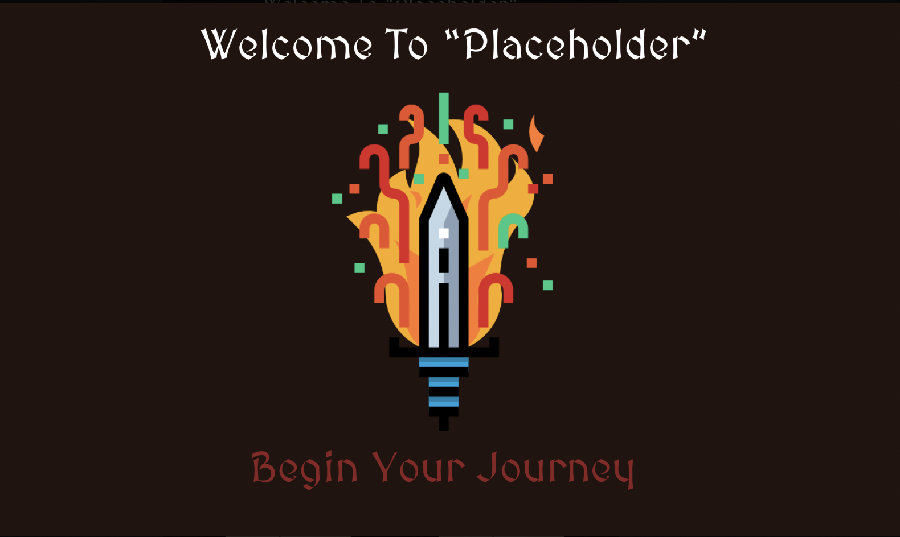

# Routes
https://docs.google.com/drawings/d/1aX2_-uw0F1DmUnUbh0XM9_UThJbE17eQzKSNs7T1E-0/edit
## GET

/ - Home page - 
    >Introduction to app (click to disappear)
    >demo video clip 
    >navbar with login

    

/login 
    - Where the user can log in or create an account

then user is redirected to 

/mycampaigns
    - button to create new campaigns    
    leads to 
        /campaigns/new - Where the users can create a new campaign 
            -name
            -brief description

    - see all campaigns
    when user clicks on a campaign
        /campaign/:id

        /campaign/:id/add - Where the users can create a new npc
            -Name
            -alignment 
            -hp 
            -description

## POST

/api/users - CREATE a new user

/api/users/login - CREATE logged in session data

/api/npc - CREATE new flash cards

/api/campaign